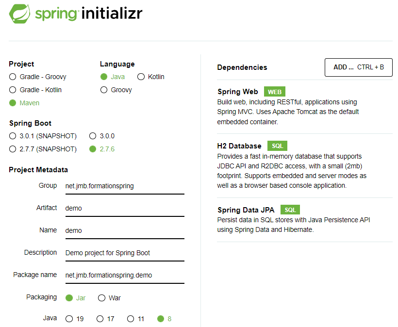
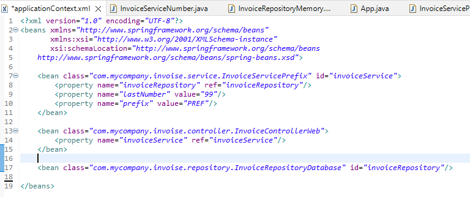
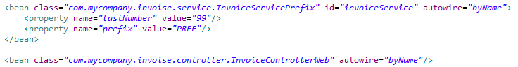
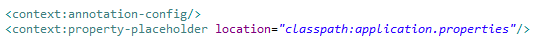

### 05 - Initialisation du projet Spring Boot

[Initialisation du projet demo](https://start.spring.io/)



Générer le projet et le dézipper dans le répertoire Git principal qui a été créé préalablement

Puis importer le projet maven dans eclipse (import Git -> Smart Import)

Créer la page d'accueil `index.html`dans `/src/main/resources/static`

Exécuter le projet : `mvnw spring-boot:run`

Et voir le résultat sur http://localhost:8080/

### 09 - Programmation par contrat pour résoudre le problème de la flexibilité

Les dépendances font désormais référence à des interfaces plutôt qu'à des classes concrètes et ne sont pas instanciées directement par les objets qui en ont besoin.

Ceci permet d'assouplir les contraintes entre les composants des différentes couches logicielles : couplage faible pour plus de flexibilité.

Les interfaces définissent de manière abstraite la façon dont les composants communiquent : ce sont les contrats.

Un composant central a pour responsabilité l'instanciation des objets concrets et leur injection dans les objets qui en ont besoin : c'est l'injection de dépendances.

### 14 - Affectation de valeur à un composant Spring



L'attribut `value` de la balise `<property>` permet d'affecter une valeur à un attribut de bean géré par le conteneur Spring.

Les types d'objets que Spring est capable de convertir automatiquement sont :
- les types primitifs (int, long, ...)
- String
- Properties
- URL
- File
- Class

### 15 - Injection automatique par nom ou par type



On peut utiliser l'attribut `default-autowire` de la balise `<beans>` ou  l'attribut `autowire` de la balise `<bean>` pour injecter automatiquement les références de beans en tant que dépendances sans avoir à les écrire dans le fichier de configuration.

Les valeurs courantes de ces attributs sont `byName`ou `byType`

### 17 - Affectation de propriété par annotation @Value

On peut affecter aux attributs de beans une valeur configurée dans un fichier de propriétés

`applicationContext.xml`


Fichier `application.properties`
```properties
invoice.prefix = PREF
invoice.lastNumber = 184
```
Fichier java
```java
public class InvoiceServicePrefix implements InvoiceServiceInterface {	
	@Value("${invoice.lastNumber}")
	private long lastNumber;	
	@Value("${invoice.prefix}")
	private String prefix;
	
```


### 20 - Se passer du fichier XML

Grâce aux classes de configuration, il est possible de déplacer toute la config XML dans une classe java annotée `@Configuration`

Les beans sont instanciés par cette classe

```java
@Configuration
@ComponentScan("com.mycompany.invoise")
@PropertySource("classpath:application.properties")
public class AppConfig {
	@Bean
	InvoiceControllerInterface invoiceController() {
		return new InvoiceControllerWeb();
	}
	@Bean
	InvoiceServiceInterface invoiceService() {
		return new InvoiceServicePrefix();
	}
	@Bean
	InvoiceRepositoryInterface invoiceRepository() {
		return new InvoiceRepositoryDatabase();
	}
}
```

Le contexte Spring est alors donné par 

```java
ApplicationContext context = new AnnotationConfigApplicationContext(AppConfig.class);
```

Les dépendances sont injectées par l'annotation `Autowired` dans les beans qui en ont besoin

```java
public class InvoiceServicePrefix implements InvoiceServiceInterface {
	...	
	@Autowired
	private InvoiceRepositoryInterface invoiceRepository;
    ...
```


### 21 - Classes de configuration plus en détail

Il est possible de placer l'annotation `@configuration` sur n'importe quelle classe, y compris celle qui contient la méthode `main()`

Et d'avoir autant de classes de configuration qu'on le souhaite

```java
@Configuration
@ComponentScan("com.mycompany.invoise")
public class App {
	public static void main(String[] args) {		
		@SuppressWarnings("resource")
		ApplicationContext context = new AnnotationConfigApplicationContext(App.class);
		InvoiceControllerInterface invoiceController = context.getBean(InvoiceControllerInterface.class);
		invoiceController.createInvoice();		
	} 
}


@Configuration
@PropertySource("classpath:application.properties")
public class AppConfigPropertySource {}


@Configuration
public class AppConfigBeanFactory {	
	@Bean
	InvoiceControllerInterface invoiceController() {
		return new InvoiceControllerWeb();
	}	
	@Bean
	InvoiceServiceInterface invoiceService() {
		return new InvoiceServicePrefix();
	}	
	@Bean
	InvoiceRepositoryInterface invoiceRepository() {
		return new InvoiceRepositoryDatabase();
	}
}
```


### 22 - Spring boot - @SpringBootApplication

Spring Boot nécessite au minimum la dépendance suivante dans le fichier `pom.xml`

```xml
		<dependency>
            <groupId>org.springframework.boot</groupId>
            <artifactId>spring-boot-autoconfigure</artifactId>
            <version>2.2.4.RELEASE</version>
        </dependency>
```


Dans la classe principale `App`, l'annotation `@SpringBootApplication` combine (et remplace donc) différentes annotations telles que `@configuration`, `@ComponentScan` et `@PropertySource("classpath:application.properties")` 

La méthode statique `run()` de la classe `SpringApplication` renvoie un objet `ApplicationContext`

```java
@SpringBootApplication
public class App {
	public static void main(String[] args) {		
		ApplicationContext context = SpringApplication.run(App.class);
		InvoiceControllerInterface invoiceController = context.getBean(InvoiceControllerInterface.class);
		invoiceController.createInvoice();		
	}
}
```


### 24 - Spring boot - Déployer l'application

Spring Boot fournit le plugin `spring-boot-maven-plugin` qui permet de créer un jar exécutable lors de la phase package, avec toutes les dépendances. 

Fichier  `pom.xml`

```xml
	<build>
		<plugins>
			<plugin>
				<groupId>org.springframework.boot</groupId>
				<artifactId>spring-boot-maven-plugin</artifactId>
			</plugin>
		</plugins>
	</build>
```


### 26 - Spring boot web

Spring Boot fournit le starter `spring-boot-starter-web` qui permet de créer une application web avec un serveur Tomcat embarqué.

`pom.xml`

```xml
	<dependencies>
		<dependency>
            <groupId>org.springframework.boot</groupId>
            <artifactId>spring-boot-starter-web</artifactId>
        </dependency>    
	</dependencies>
```


Par défaut, Spring Boot cherche dans le répertoire `classpath:/static` le contenu web statique (pages HTML) à servir aux utilisateurs :

- Le port par défaut est 8080
- Le nom de contexte est vide
- La ressource web par défaut est `index.html`


### 27 - Spring auto configuration

L'annotation `@SpringBootApplication` inclut également l'annotation `@EnableAutoConfiguration` .

Elle indique à Spring de chercher dans les librairies du projet les classes de configuration qui fournissent les composants et valeurs de propriétés par défaut.

Ces valeurs par défaut  peuvent être surchargées par configuration.

Les propriétés concernées sont listées ici : https://docs.spring.io/spring-boot/docs/current/reference/html/application-properties.html

 `application.properties`

```properties
server.port = 80
server.servlet.context-path = /invoice
```


Pour remplacer le serveur web, il faut exclure la dépendance vers celui par défaut et rajouter celle vers celui voulu

`pom.xml`

```xml
	<dependencies>
		<dependency>
            <groupId>org.springframework.boot</groupId>
            <artifactId>spring-boot-starter-web</artifactId>
            <exclusions>
            	<exclusion>
            		<groupId>org.springframework.boot</groupId>
            		<artifactId>spring-boot-starter-tomcat</artifactId>
            	</exclusion>
            </exclusions>
		</dependency>		
		<dependency>
            <groupId>org.springframework.boot</groupId>
            <artifactId>spring-boot-starter-undertow</artifactId>
		</dependency>       
	</dependencies>
```


### 30 - Spring MVC - contrôleur frontal `DispatcherServlet` et contrôleurs `@Controller`

Spring MVC est un framework web (structure de composants logiciels sous-jacente à une application et qui définit son architecture).

> Doc de référence : https://docs.spring.io/spring-framework/docs/current/reference/html/web.html


Il fait appel au contrôleur central `DispatcherServlet` qui intercepte toutes les requêtes HTTP qui lui sont destinées :

- Avec Spring Boot, `DispatcherServlet` est initialisé grâce à l'auto configuration (classe `DispatcherServletAutoConfiguration`) 

- Dans une webapp standard au niveau servlet 3 et +, il l'est en étendant la classe `AbstractDispatcherServletInitializer`  ou `AbstractAnnotationConfigDispatcherServletInitializer`


Par défaut le chemin des requêtes interceptées est ` / ` : toutes les requêtes sont interceptées.

Ce chemin est modifiable avec la propriété `spring.mvc.servlet.path`


Le contrôleur frontal `DispatcherServlet` délègue le traitement des requêtes à des contrôleurs simples : ce sont les classes annotées `@Controller`

Le choix du contrôleur et de la méthode à invoquer provient de la configuration du chemin via l'annotation `@RequestMapping`

Exemple pour le chemin `/home` (càd l'URL http://localhost/invoice/home)

```java
@Controller
public class InvoiceControllerWeb implements InvoiceControllerInterface {	
	...
	@RequestMapping("/home")
	public String displayHome() {
		System.out.println("Invocation de InvoiceControllerWeb.displayHome()");
		return "";
	}
...
```


Une fois le traitement effectué, le contrôleur frontal renvoie ou redirige l'utilisateur vers une vue  


